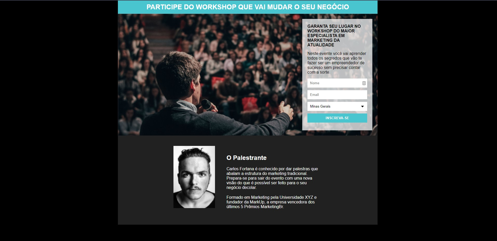

# Capture Page with Mailchimp System

This is the solution of a project proposed in the "COURSE DEVELOPMENT WEB FULL STACK" by @progbr.

## Table of contents

- [Overview](#overview)
  - [Screenshot](#screenshot)
  - [Links](#links)
- [My process](#my-process)
  - [Built with](#built-with)
  - [Construction method](#construction-method)
- [Author](#author)

## Overview

### Screenshot

### Links

- Solution URL : [Capture Page](https://devfborges.github.io/capture-system/)

## My process

### Built with

- HTML5
- CSS

### Construction method

- This was an apprenticeship guided by @progbr to put into practice the skills acquired in the first modules of the course. Where I made the most of each explanation and was curious enough to test the behavior of each CSS attribute applied to HTML elements.

## Author

- My Profile - [Felipe Borges](https://github.com/FelipeBorge5)
- Instagram - [@felipe.bgx](https://www.instagram.com/felipe.bgx/)
- LinkedIn - [@devfelipeborges](https://www.linkedin.com/in/devfelipeborges/)
